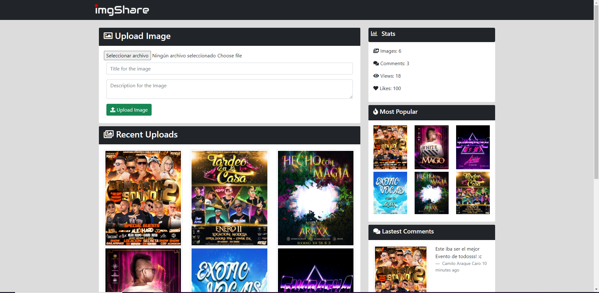

## imgShare is a web application to share images, comments, and more.



# Enviroment Variables

- `MONGO_URI`, The db mongodb uri
- `PORT` http server port. default is `3000`

# Installation

```
git clone https://github.com/AraqueGD/ImgShare.git
cd Imgshare
npm install
npm start
```

# Improvements for the Future

- Input Validation (to avoid XSS)
- User Authentication

# Author

- Camilo Araque <https://github.com/AraqueGD>
